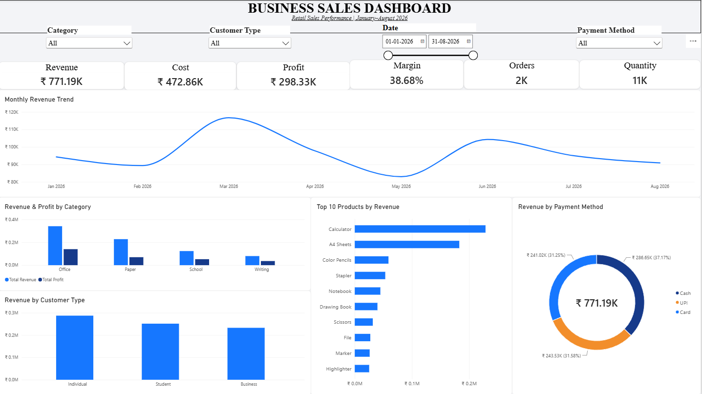
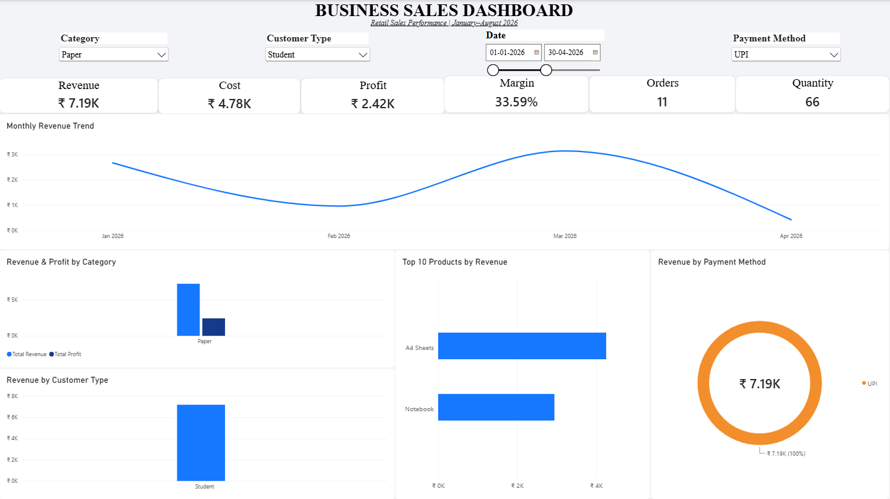
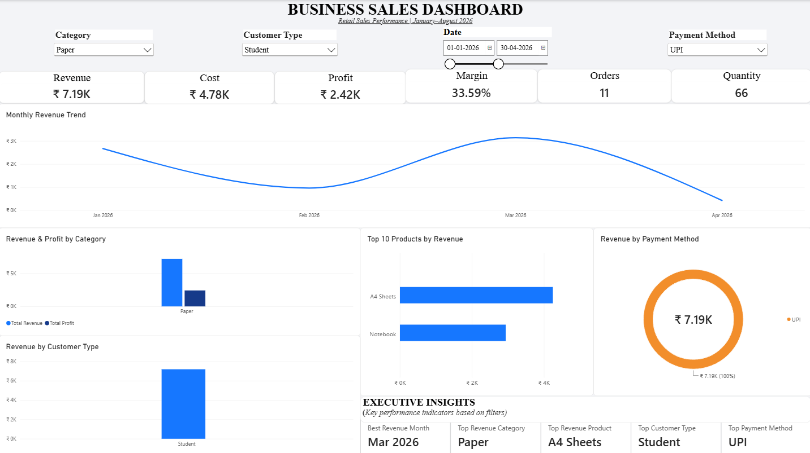

# Retail Sales Analytics Dashboard

## Project Overview

An interactive Business Intelligence dashboard developed to analyze retail sales performance across revenue, costs, profitability, products, customer segments, and payment methods.

The solution transforms raw transaction data into an interactive Power BI dashboard that enables users to explore business performance using category, customer type, payment method, and date filters.

---

## Business Problem

Businesses often maintain sales information in spreadsheets or CSV files, making it difficult to quickly answer questions such as:

- How much revenue is being generated?
- How profitable is the business?
- Which month generates the most revenue?
- Which products contribute the most revenue?
- Which customer segments generate the most sales?
- Which payment methods contribute the most revenue?
- How does performance change when different filters are applied?

The objective of this project was to convert transaction-level sales data into an easy-to-understand analytical dashboard.

---

## Solution

A complete data analytics workflow was developed:

Raw Sales Data
↓
Data Cleaning & Transformation
↓
Data Modeling
↓
DAX Measures
↓
Interactive Power BI Dashboard
↓
Business Insights

The dashboard allows users to interactively filter the analysis by:

- Category
- Customer Type
- Payment Method
- Date Range

---

## Key Dashboard Metrics

The full dataset contains:

- Revenue: ₹771.19K
- Cost: ₹472.86K
- Profit: ₹298.33K
- Profit Margin: 38.68%
- Orders: 2K
- Units Sold: 11K

---

## Dashboard Features

### Revenue Performance
Monthly revenue trend analysis from January to August 2026.

### Category Analysis
Comparison of revenue and profit across product categories.

### Product Analysis
Top 10 products ranked by revenue.

### Customer Analysis
Revenue comparison across customer types.

### Payment Analysis
Revenue contribution by payment method.

### Interactive Filtering
Users can dynamically filter the entire dashboard by category, customer type, payment method, and date range.

### Dynamic Executive Insights
The dashboard dynamically identifies:

- Peak revenue month
- Top revenue category
- Top revenue product
- Top customer segment
- Top payment method

---

## Tools & Technologies

- Python
- Pandas
- Power BI
- Power Query
- DAX
- CSV

---

## Key Findings

Based on the full dataset:

- March 2026 generated the highest monthly revenue.
- Office was the highest-revenue category.
- Calculator was the highest-revenue product.
- Individual customers generated the highest revenue among customer segments.
- Cash was the largest revenue-contributing payment method.
- Overall profit margin was 38.68%.

These findings can help a business identify high-performing products, categories, customer segments, and periods.

---

## Business Recommendations

Based on the analysis, a business could:

1. Prioritize inventory planning for high-revenue products.
2. Monitor high-performing categories to maintain product availability.
3. Analyze customer-segment purchasing patterns for targeted promotions.
4. Monitor monthly revenue fluctuations to improve sales planning.
5. Encourage payment methods that provide operational or customer-experience advantages.
6. Review product-level profitability alongside revenue before making inventory decisions.

---

## Project Outcome

The project demonstrates an end-to-end Business Analytics workflow, from raw transaction data preparation to interactive reporting and business insights.

The resulting dashboard provides a centralized view of sales performance and enables users to explore the data without manually analyzing individual transactions.

---

## Portfolio Screenshots

### Full Dashboard

### Filtered Dashboard

### Executive Insights

---

## Skills Demonstrated

- Data Cleaning
- Data Transformation
- Exploratory Data Analysis
- Business Intelligence
- Power BI Dashboard Development
- Power Query
- DAX
- Data Visualization
- KPI Development
- Interactive Reporting
- Business Insight Generation